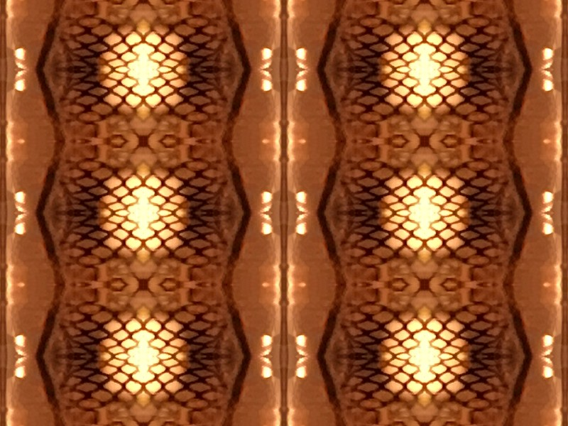

#Symmetry

This is a processing sketch that samples a tile from an image, it then flips that on x, y and x+y. The tile size grows, then shrinks. As this occurs the origin point for sampling the image also increments/decrements. Here is a frame grab to give an idea of that this does.

The code is fairly straightforward and well commneted (now). The function setupTiles is perhaps the most perplexing thing here. In order to fill the window with no gaps the tiles are rendered larger than the window. The setupTiles function determines the x/y origin points to begin drawing the tiles from such that the center of the window is a center point for the overall symmetry. I'm sure this could be done more efficiently, but this works.

There is a line you can uncommnet to render frames and use with Processing's movie maker. Here are some examples I have made.
[Vault](https://www.youtube.com/watch?v=NvCmbCXnwys)
[Tiled Tree](https://www.youtube.com/watch?v=qdwcL9WwHh0)
[Deception Pass Bridge](https://youtu.be/-riMBmZszH4)

Experimenting with determining the origin points differently, changing setupTiles so that the symmetry is not from the center, etc. can result in some very different effects.

I've left a couple of example photos here to try this with in the repo.

Code works with Processing 2 and 3.
